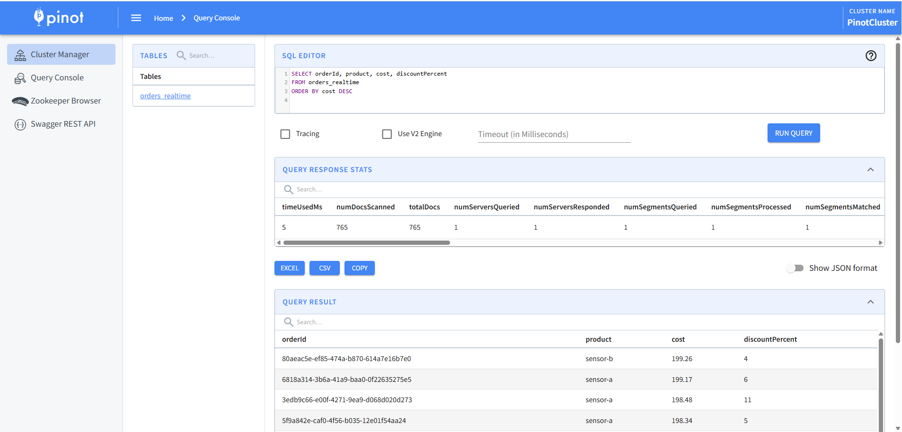

## Techs


## Run program
```bash
# All in one
docker compose up
```

## Test data in UI
* Kafka UI (Kafdrop): http://localhost:9000
  
  

* Flink UI: http://localhost:8081
  
  

* Iceberg UI: http://localhost:9001 (admin/password)
  
  

* Pinot UI: http://localhost:9003 

  
  
* Continue...

## Ports 
- **[http://localhost:9000](http://localhost:9000)** → Check data ingested in Kafka  
- **[http://localhost:8081](http://localhost:8081)** → Check job in Flink SQL via Flink UI
- **[http://localhost:9001](http://localhost:9001)** → Check files stored as HiveMeta**, MinIO, and data at `s3a://warehouse/data/`  
- **[http://localhost:9003](http://localhost:9003)** → Pinot for real-time analytics from kafka
- **[http://localhost:8082](http://localhost:8082)** → Trino query batch data from Iceberg

## Troubleshooting
### Kafka producer not sending data
```bash
docker logs -f kafka_producer
docker restart kafka_producer
```
### Flink job fails
```bash
docker logs taskmanager
docker logs jobmanager
```
### Query Iceberg data with PyIceberg
```bash
docker exec -it pyiceberg python

from pyiceberg.catalog import load_catalog
catalog = load_catalog("default")
table = catalog.load_table("default.t_i_orders")
df = table.scan().to_pandas()
print(df.head())
print(f"Total rows: {len(df)}")
```
### No data in Iceberg
```bash
- Check Flink job is running: http://localhost:8081
- Check checkpoint interval: default is 60s
- Check MinIO: http://localhost:9001 (admin/password)
```

## Plan
- [x] Data faker (data source later)
- [x] Kafka consumer (Kafdrop) + Docker manifest
- [x] Flink processing + Docker manifest
- [x] Iceberg MinIO + Docker manifest
- [x] Volume/storage checks
- [ ] Trino query + Docker manifest
- [x] Pinot real-time analytics + Docker manifest
- [ ] Kubernetes + Prometheus + Grafana monitoring deployment performance
- [ ] Optional: Export api/metrics backend for each stage 
- [ ] Optional: Build custom UI for each stage 
- [ ] !!!!Optional: Fullstack production!!!!

