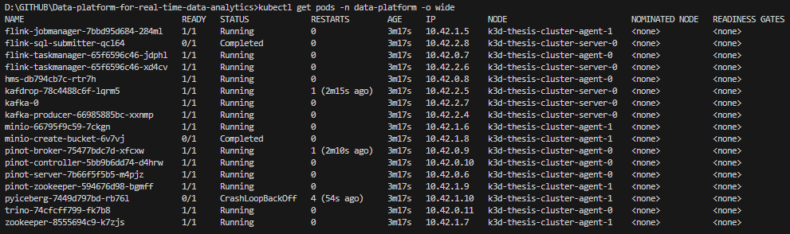
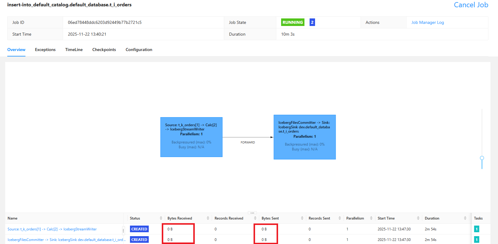

## Techs


## Prerequisites 
* Python (version >= 3.8)
* Docker 
* Make

## Run program (docker-compose)
```bash
# Run all in one
make all
```
```bash
# To stop all containers
make clean
```

## Network & Ports  
- **[http://localhost:9000](http://localhost:9000)** → Kafka UI
- **[http://localhost:8081](http://localhost:8081)** → Flink UI
- **[http://localhost:9001](http://localhost:9001)** → Minio UI (HiveMeta, MinIO, json data)
- **[http://localhost:9003](http://localhost:9003)** → Pinot real-time analytics
- **[http://localhost:8082](http://localhost:8090)** → Trino query engine UI

## Test data in UI
* Kafka UI (Kafdrop): http://localhost:9000

  

  Alternative option: Test on CLI

  ```bash
  # List topics
  docker exec -it broker kafka-topics --list --bootstrap-server broker:9092
  ```

  ```bash
  # Read data from a topic
  docker exec -it broker kafka-console-consumer \
  --bootstrap-server broker:9092 \
  --topic orders \
  --from-beginning
  ```

* Flink UI: http://localhost:8081
  
  

  Alternative option: Test on CLI

  ```bash
  # List running jobs
  docker exec -it jobmanager flink list
  ```

* Iceberg UI: http://localhost:9001 (admin/password)
  
  

  Alternative option: Test on CLI

  ```bash
  # List buckets
  docker exec -it createbuckets /usr/bin/mc ls minio/warehouse
  ```

  ```bash
  # List iceberg catalogs in PyIceberg
  docker exec -it pyiceberg python -m pyiceberg list dev
  ```

* Pinot UI: http://localhost:9003 

  

  Alternative option: Test on CLI

  ```bash
  # List tables
  docker exec -it pinot-controller /opt/pinot/bin/pinot-admin.sh ListTables \
  -controllerHost pinot-controller \
  -controllerPort 9000
  ```

  ```bash
  # Query data from a table
  docker exec -it pinot-controller \
  /opt/pinot/bin/pinot-admin.sh Query \
  -brokerHost pinot-broker \
  -brokerPort 8099 \
  -query "SELECT * FROM orders_REALTIME LIMIT 5"
  ```

* Trino UI: http://localhost:8090 

  ```bash
  # Open Shell
  docker exec -it trino trino
  ```
  
  ```bash
  # Access schema and query data from a table
  SHOW CATALOGS;
  USE iceberg.default;
  SHOW TABLES;
  SELECT * FROM orders LIMIT 5;
  ```

  

## Troubleshooting
### Kafka producer not sending data
```bash
docker logs -f kafka_producer
docker restart kafka_producer
```
### Flink job fails
```bash
docker logs taskmanager
docker logs jobmanager
```
### Query Iceberg data with PyIceberg
```bash
docker exec -it pyiceberg python

from pyiceberg.catalog import load_catalog
catalog = load_catalog("default")
table = catalog.load_table("default.t_i_orders")
df = table.scan().to_pandas()
print(df.head())
print(f"Total rows: {len(df)}")
```
### No data in Iceberg
```bash
- Check Flink job is running: http://localhost:8081
- Check checkpoint interval: default is 60s
- Check MinIO: http://localhost:9001 (admin/password)
```

---------------------------------------------------------------------------------------

## Run program (Kubernetes)

```bash
# Create a local Docker Registry
k3d registry create thesis-registry --port 51121

# Forward necessary ports to localhost
k3d cluster create thesis-cluster --registry-use k3d-thesis-registry:51121 --agents 2 -p "30090:30090@server:0" -p "31001:31001@server:0" -p "31002:31002@server:0" -p "8081:8081@server:0" -p "9003:9003@server:0" -p "31080:31080@server:0" --api-port 127.0.0.1:6443

# Build and import Docker images
docker build -t thesis-flink:latest ./flink
docker build -t kafka-producer:latest -f kafka/Dockerfile .
docker build -t iceberg-hms:latest ./iceberg

k3d image import kafka-producer:latest thesis-flink:latest iceberg-hms:latest  -c thesis-cluster

# Namespace to organize and isolate the application resources
kubectl create namespace data-platform
helm upgrade --install realtime-platform ./helm -n data-platform

# Deploy/upgrade entire application using Helm chart
kubectl get pods -n data-platform -o wide
```

Wait 10-20s for all services ready



### Network and ports

- **[http://localhost:30090](http://localhost:30090)** → Kafka UI
- **[http://localhost:31080](http://localhost:31080)** → Flink UI
- **[http://localhost:31001](http://localhost:31001)** → MinIO UI

### Current issues:
* Flink UI, data is NOT sent and received, cause restarting once submitted jobs.



### Plan

- [x] Zookeeper
- [x] Kafka
- [ ] Flink
- [ ] MinIO
- [ ] Hive Metastore
- [ ] Pinot
- [ ] Trino
- [ ] PyIcebergaZAAZAAZZ
- [ ] Prometheus 
- [ ] Grafana