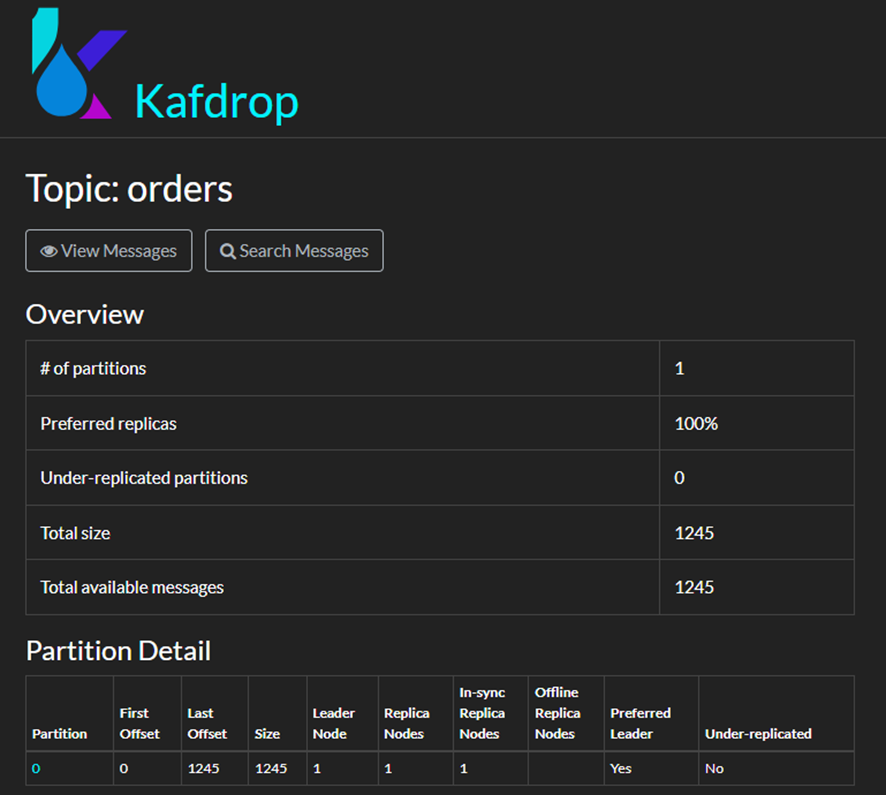
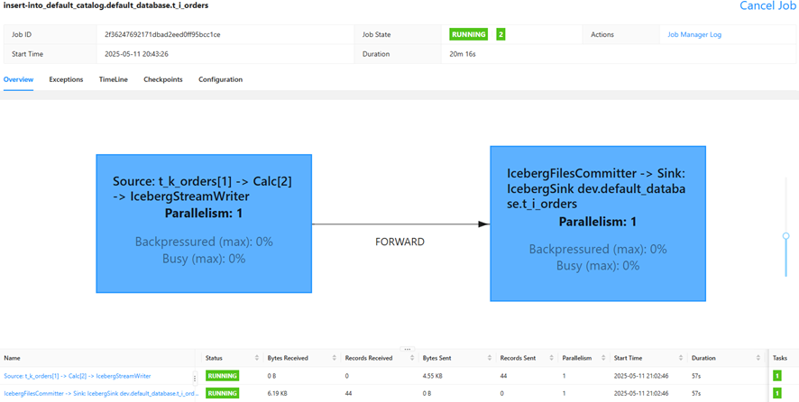
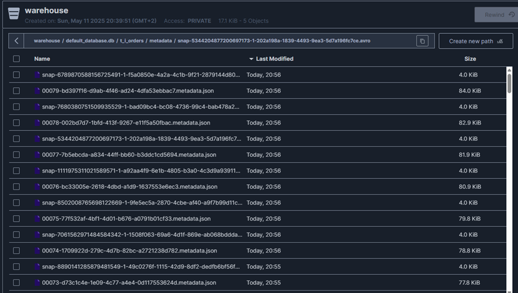
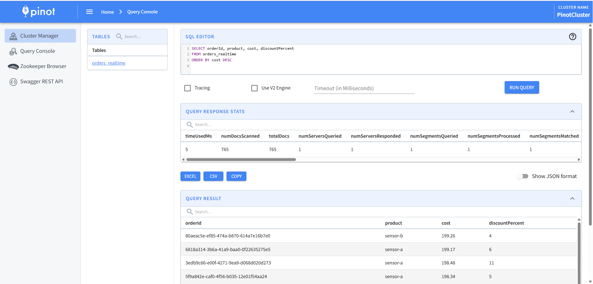
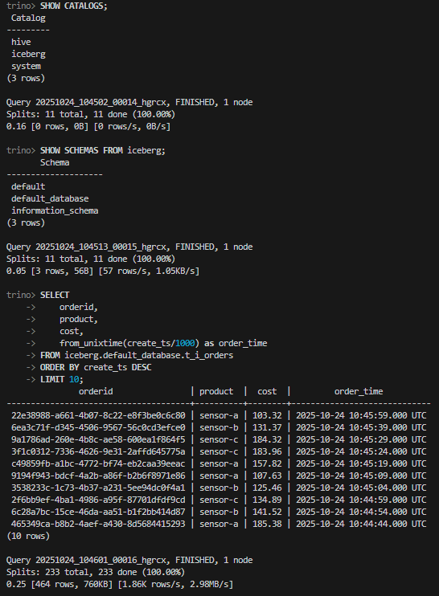

## Techs


## Prerequisites 
* Python (version >= 3.8)
* Docker 
* Make

## Run program
```bash
# Run all in one
make all
```
```bash
# To stop all containers
make clean
```

## Network & Ports  
- **[http://localhost:9000](http://localhost:9000)** → Kafka UI
- **[http://localhost:8081](http://localhost:8081)** → Stream processing UI
- **[http://localhost:9001](http://localhost:9001)** → Object storage UI (HiveMeta, MinIO, json data)
- **[http://localhost:9003](http://localhost:9003)** → Pinot real-time analytics
- **[http://localhost:8082](http://localhost:8090)** → Trino query engine UI

## Test data in UI
* Kafka UI (Kafdrop): http://localhost:9000

  

  Other test option: Test on CLI

  ```bash
  # List topics
  docker exec -it broker kafka-topics --list --bootstrap-server broker:9092
  ```

  ```bash
  # Read data from a topic
  docker exec -it broker kafka-console-consumer \
  --bootstrap-server broker:9092 \
  --topic orders \
  --from-beginning
  ```

* Flink UI: http://localhost:8081
  
  

  Other test option: Test on CLI

  ```bash
  # List running jobs
  docker exec -it jobmanager flink list
  ```

* Iceberg UI: http://localhost:9001 (admin/password)
  
  

  Other test option: Test on CLI

  ```bash
  # List buckets
  docker exec -it createbuckets /usr/bin/mc ls minio/warehouse
  ```

  ```bash
  # List iceberg catalogs in PyIceberg
  docker exec -it pyiceberg python -m pyiceberg list dev
  ```

* Pinot UI: http://localhost:9003 

  

  Other test option: Test on CLI

  ```bash
  # List tables
  docker exec -it pinot-controller /opt/pinot/bin/pinot-admin.sh ListTables \
  -controllerHost pinot-controller \
  -controllerPort 9000
  ```

  ```bash
  # Query data from a table
  docker exec -it pinot-controller \
  /opt/pinot/bin/pinot-admin.sh Query \
  -brokerHost pinot-broker \
  -brokerPort 8099 \
  -query "SELECT * FROM orders_REALTIME LIMIT 5"
  ```

* Trino UI: http://localhost:8082 

  ```bash
  # Open Shell
  docker exec -it trino trino

  ```
  ```bash
  # Access schema and query data from a table
  SHOW CATALOGS;
  USE iceberg.default;
  SHOW TABLES;
  SELECT * FROM orders LIMIT 5;
  ```

  

* Continue...

## Troubleshooting
### Kafka producer not sending data
```bash
docker logs -f kafka_producer
docker restart kafka_producer
```
### Flink job fails
```bash
docker logs taskmanager
docker logs jobmanager
```
### Query Iceberg data with PyIceberg
```bash
docker exec -it pyiceberg python

from pyiceberg.catalog import load_catalog
catalog = load_catalog("default")
table = catalog.load_table("default.t_i_orders")
df = table.scan().to_pandas()
print(df.head())
print(f"Total rows: {len(df)}")
```
### No data in Iceberg
```bash
- Check Flink job is running: http://localhost:8081
- Check checkpoint interval: default is 60s
- Check MinIO: http://localhost:9001 (admin/password)
```

## Plan
- [x] Data faker (data source later)
- [x] Kafka consumer (Kafdrop) + Docker manifest
- [x] Flink processing + Docker manifest
- [x] Iceberg MinIO + Docker manifest
- [x] Volume/storage checks
- [x] Trino query + Docker manifest
- [x] Pinot real-time analytics + Docker manifest
- [ ] Kubernetes + Prometheus + Grafana monitoring deployment performance
- [ ] Optional: Export api/metrics backend for each manifest
- [ ] Optional: Build custom UI for services
- [ ] !!!!Optional: Fullstack production!!!!

